## Layers and attributes 

### Forest

Forest layer with name of the objects, by combining the two common classifications.

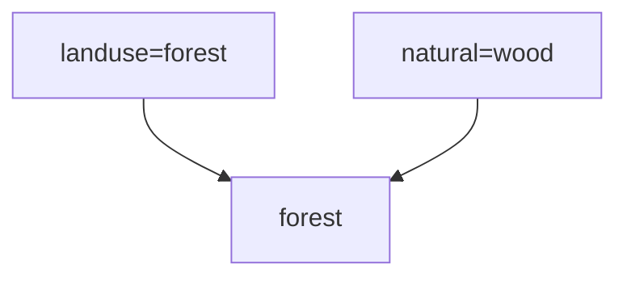

| Attribute | Type | Index | Describtion |
| :---      | :--- | :---  | :---       |
| area_id | int | | Id of OSM object, needed for running updates |
| fid | int | | Feature id |
| name | text | | Name of the object |
| name_en | text | | Englisch name of the object | 
| geom | Multipolygon geometry | GiST | Multipolygon geometry of the OSM object |

### Water

Water area layer with name of the objects, by combining the two common classifications.

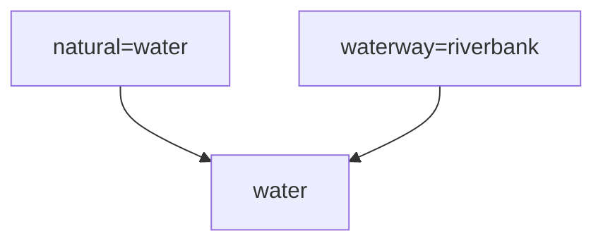

| Attribute | Type | Index | Describtion |
| :---      | :--- | :---  | :---        |
| area_id | int | | Id of OSM object, needed for running updates |
| fid | int | | Feature id |
| name | text | | Name of the object |
| name_en | text | | Englisch name of the object | 
| geom | Multipolygon geometry | GiST| Multipolygon geometry of the OSM object |

### Grass

Area layer for different kind of grass like vegetation with name of the objects.

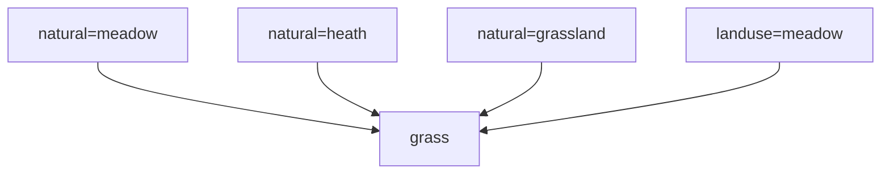

| Attribute | Type | Index | Describtion |
| :---      | :--- | :---  | :---        |
| area_id | int | | Id of OSM object, needed for running updates |
| fid | int | | Feature id |
| name | text | | Name of the object |
| name_en | text | | Englisch name of the object | 
| geom | Multipolygon geometry | GiST| Multipolygon geometry of the OSM object |

### Building

Buildings layer with name, and adress of the objects.

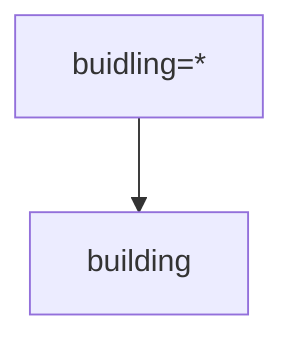

| Attribute | Type | Index | Describtion |
| :---      | :--- | :---  | :---        |
| area_id | int | | Id of OSM object, needed for running updates |
| fid | int | | Feature id |
| building | text | B-Tree | Content of the ```building``` tag | 
| name | text | | Name of the object |
| name_en | text | | Englisch name of the object | 
| street | text | | Content of the ```addr:street``` tag | 
| housenumber | text | | Content of the ```addr:housenumber``` tag | 
| postcode | text | | Content of the ```addr:postcode``` tag | 
| city | text | | Content of the ```addr:city``` tag | 
| geom | Multipolygon geometry | GiST | Multipolygon geometry of the OSM object |

### Traffic

Line layer with roads and railways with name of the objects, and essential other tags in a cleaned way.

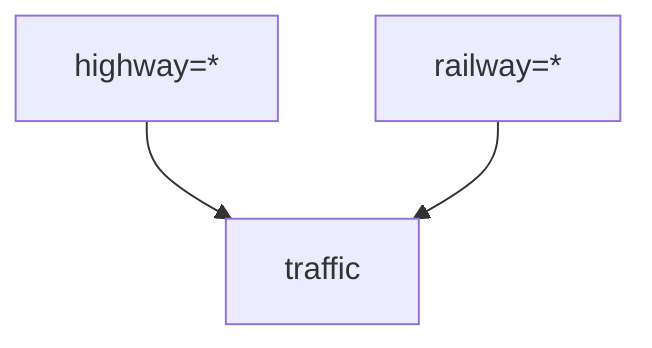

| Attribute | Type | Index | Describtion |
| :---      | :--- | :---  | :---        |
| way_id | int | | Id of OSM object, needed for running updates |
| fid | int | B-Tree | Feature id |
| highway | text | B-Tree | Content of the ```highway``` tag | 
| railway | text | B-Tree | Content of the ```railway``` tag | 
| name | text | | Name of the object |
| name_en | text | | Englisch name of the object | 
| ref | bool | | Content of the ```ref``` tag | 
| service | text | | Content of the ```service``` tag | 
| usage | text | | Content of the ```usage``` tag | 
| tracktype | text | | Content of the ```tracktype``` tag | 
| trail_visibility | text | | Content of the ```trail_visibility``` tag |
| surface | text | | Content of the ```surface``` tag |
| oneway | bool | B-Tree | Content of the ```oneway``` tag converted to a bool | 
| bridge | bool | B-Tree | Content of the ```bridge``` tag converted to a bool | 
| tunnel | bool | B-Tree |  Content of the ```tunnel``` tag converted to a bool | 
| layer | real | B-Tree | Content of the ```layer``` tag converted to a number | 
| z_layer | real | B-Tree | Calculate rendering order | 
| geom | Linestring geometry | GiST | Linestring geometry of the OSM object |

### Waterway

Waterway linstring layer with name of the objects, and common attributes.

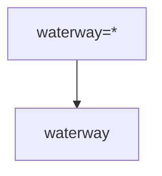

| Attribute | Type | Index | Describtion |
| :---      | :--- | :---  | :---        |
| way_id | int | | Id of OSM object, needed for running updates |
| fid | int | | Feature id |
| waterway | text | B-Tree | Content of the ```oneway``` tag |
| intermittent | bool | B-Tree | Content of the ```intermittent``` tag converted to a bool | 
| tunnel | bool | B-Tree |  Content of the ```tunnel``` tag converted to a bool | 
| layer | real | | Content of the ```layer``` tag converted to a number | 
| name | text | | Name of the object |
| name_en | text | | Englisch name of the object | 
| geom | Linestring geometry | GiST| Linestring geometry of the OSM object |

### Address

Address point layer with street, housenumber, postcode, and city.

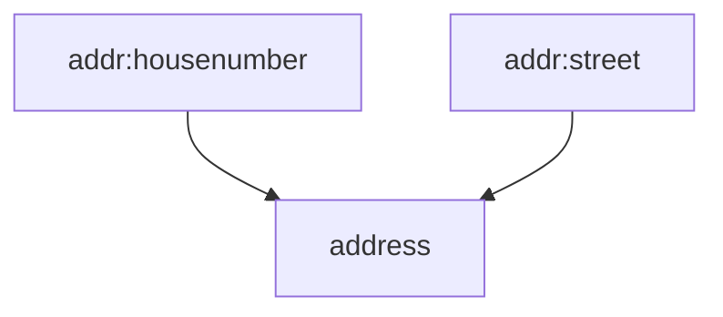

| Attribute | Type | Index | Describtion |
| :---      | :--- | :---  | :---        |
| node_id | int | | Id of OSM object, needed for running updates |
| fid | int | | Feature id |
| street | text | | Content of the ```addr:street``` tag | 
| housenumber | text | | Content of the ```addr:housenumber``` tag | 
| postcode | text | | Content of the ```addr:postcode``` tag | 
| city | text | | Content of the ```addr:city``` tag | 
| osm_geom | Geometry | GiST | Geometry of the OSM object |
| geom | Point geometry | GiST | ST_PointonfSurface of OSM object |


### Elevation point

Peaks, vulcanos, saddles and view points in one table with their elevation.

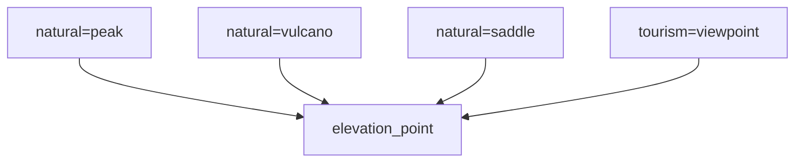

| Attribute | Type | Index | Describtion |
| :---      | :--- | :---  | :---        |
| node_id | int | | Id of OSM object, needed for running updates |
| fid | int | | Feature id |
| name | text | | Name of the object |
| name_en | text | | Englisch name of the object | 
| type | text | B-Tree | Content of the ```natural``` tag or the ```tourism``` tag | 
| direction | text | | Content of the ```direction``` tag | 
| ele | real | B-Tree | Content of the ```ele``` tag converted to a number | 
| geom | Point geometry | GiST | Multipolygon geometry of the OSM object |


### Admin boundary line

Administrative boundaries as lines. Useful for rendering.

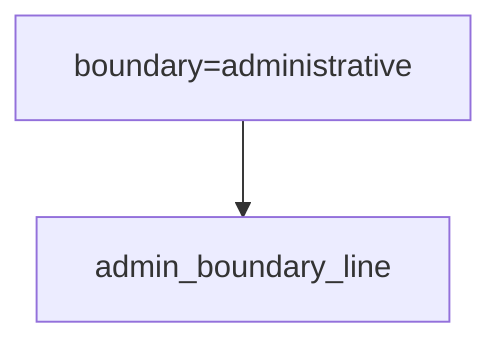

| Attribute | Type | Index | Describtion |
| :---      | :--- | :---  | :---        |
| way_id | int | | Id of OSM object, needed for running updates |
| fid | int | | Feature id |
| name | text | | Name of the object |
| name_en | text | | Englisch name of the object | 
| admin_level | text | B-Tree | Content of the ```admin_level``` tag | 

### Admin boundary area

Administrative boundaries as lines. Useful for processing and analysis.

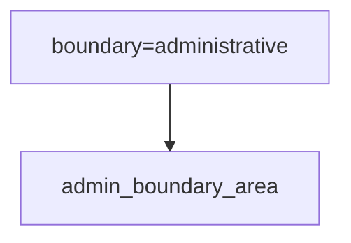

| Attribute | Type | Index | Describtion |
| :---      | :--- | :---  | :---        |
| area_id | int | | Id of OSM object, needed for running updates |
| fid | int | | Feature id |
| name | text | | Name of the object |
| name_en | text | | Englisch name of the object | 
| admin_level | text | B-Tree | Content of the ```admin_level``` tag | 

### POI 

Collects many tags and offer them as a point geometry.

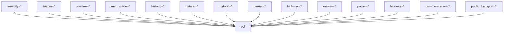

| Attribute | Type | Index | Describtion |
| :---      | :--- | :---  | :---        |
| osm_id | int | | Id of OSM object, needed for running updates |
| fid | int | | Feature id |
| name | text | | Name of the object |
| name_en | text | | Englisch name of the object | 
| leisure | text | B-Tree | Content of the ```leisure``` tag | 
| tourism | text | B-Tree | Content of the ```tourism``` tag | 
| historic | text | B-Tree | Content of the ```historic``` tag | 
| man_made | text | B-Tree | Content of the ```man_made``` tag | 
| natural | text | B-Tree | Content of the ```natural``` tag | 
| amenity| text | B-Tree | Content of the ```amenity``` tag | 
| shop | text | B-Tree | Content of the ```shop``` tag | 
| public_transport | text | B-Tree | Content of the ```public_transport``` tag | 
| highway | text | B-Tree | Content of the ```highway``` tag | 
| railway | text | B-Tree | Content of the ```railway``` tag | 
| power | text | B-Tree | Content of the ```power``` tag | 
| landuse | text | B-Tree | Content of the ```landuse``` tag | 
| communication | text | B-Tree | Content of the ```communication``` tag | 
| barrier | text | B-Tree | Content of the ```barrier``` tag | 
| information | text | B-Tree | Content of the ```information``` tag | 
| tags | JSONB | | All tags of the OSM object |
| osm_geom | Geometry collection | GiST | Geometry of the OSM object |
| geom | Point geometry | | Point geometry of the OSM object generatet via ST_PointOnSurface on demand |
